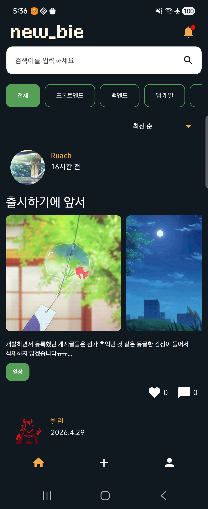
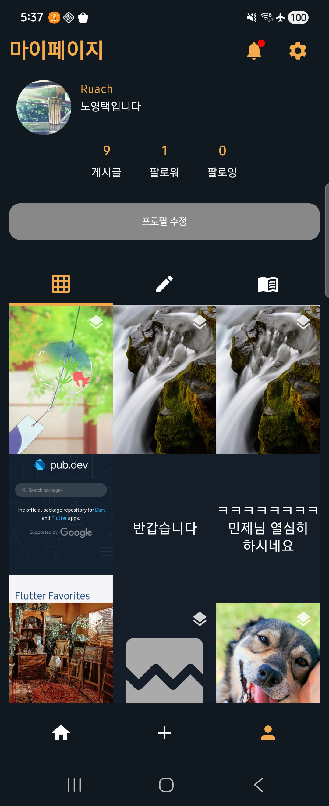
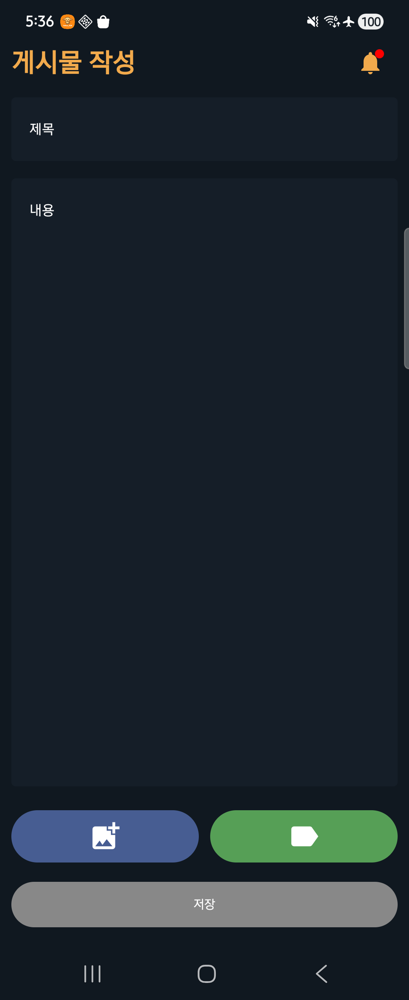
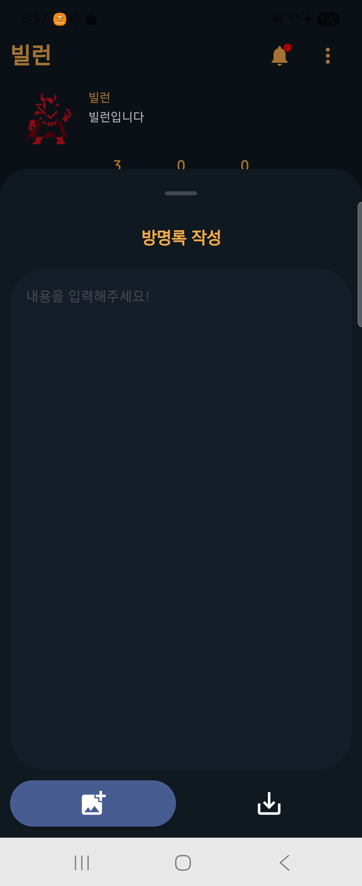
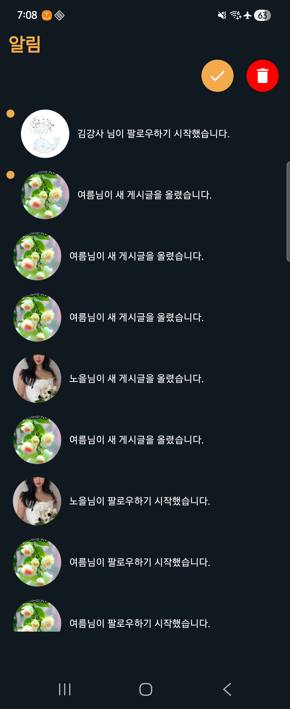

<div align="center">
  

# /:new_bie

**개발자를 위한 소셜 매칭 및 프로필 관리 서비스**

[]()
[]()
[]()
</div>

<br/>

## 서비스 소개
**NewBie(뉴비)**는 사용자 간의 활발한 소통과 네트워킹, 그리고 팀 프로젝트 매칭을 돕기 위해 개발된 안드로이드 애플리케이션입니다. 
개인의 성장 일지(Journal)를 기록하고, 피드를 통해 일상을 공유하며, 마음이 맞는 사람들과 실시간 채팅으로 소통하며 팀 프로젝트를 시작해 보세요!

<br/>

##  스크린샷 (Screenshots)

|          홈 / 피드           | 마이 프로필 | 게시글 포스팅 | 방명록 | 실시간 알림 |
|:-------------------------:| :---: | :---: | :---: | :---: |
|  |  |  |  |  |


<br/>

## 주요 기능 (Key Features)

### 간편한 인증 및 보안
* **소셜 로그인**: Supabase Auth 및 Google Credential Manager를 활용한 빠르고 안전한 구글 로그인
* **계정 관리**: 프로필 설정 기능

### 포스트 및 커뮤니티 (Home & Post)
* **피드 & 포스트**: 일상이나 정보를 공유하는 게시글 작성, 수정, 삭제 및 상세 보기
* **검색 기능**: 원하는 키워드로 유저 및 게시글 검색

### 프로필 & 네트워킹 (Profile & Guestbook)
* **마이 프로필**: 내 정보 확인, 프로필 사진 및 상태 업데이트
* **팔로우/언팔로우**: 관심 있는 유저와 네트워크 형성
* **방명록 (Guestbook)**: 다른 유저의 프로필에 방문하여 방명록 및 댓글 작성

### 실시간 소통 (Chatting & Notification)
* **푸시 알림**: Firebase Cloud Messaging(FCM)을 활용한 알림(새로운 팔로워, 포스팅 등) 수신

<br/>

## 기술 스택 (Tech Stack)

### Android & UI
* **Language**: Kotlin
* **UI Toolkit**: Jetpack Compose (Material 3)
* **Architecture**: MVVM, Clean Architecture (Feature-driven)
* **Dependency Injection**: Hilt (Dagger)
* **Navigation**: Jetpack Navigation Compose
* **Asynchronous**: Kotlin Coroutines, Flow / StateFlow

### Network & Local Storage
* **Network**: Retrofit2, OkHttp3
* **Image Loading**: Coil, Glide
* **Local Storage**: DataStore (Preferences)

###  Backend & Database (BaaS)
* **Supabase SDK**: `supabase-kt`, `auth-kt`, `postgrest-kt`, `realtime-kt`, `storage-kt`
* **Firebase**: FCM (Push Notifications), Analytics, Auth
* **Others**: Cloudinary (Image management)

<br/>

## 프로젝트 구조 (Project Structure)
본 프로젝트는 확장성을 고려하여 **Feature 단위 모듈화**와 **Clean Architecture** 패턴을 채택하고 있습니다.

```text
app/src/main/java/com/newBie/new_bie
 ┣ 📂 core              # 공통 유틸리티, Base 클래스, 테마(Theme), 전역 매니저
 ┣ 📂 features          # 도메인별 기능 (Feature-driven)
 ┃  ┣ 📂 auth          # 로그인, 인증
 ┃  ┣ 📂 blockUsers    # 차단된 유저 관리
 ┃  ┣ 📂 chatting      # 실시간 채팅 방 및 메시지
 ┃  ┣ 📂 journal       # 캘린더 및 일지
 ┃  ┣ 📂 notification  # 푸시 알림 리스트
 ┃  ┣ 📂 post          # 홈 피드, 게시글 작성/상세
 ┃  ┣ 📂 profile       # 마이 프로필, 팔로우, 방명록
 ┃  ┗ 📂 teamProject   # 프로젝트 매칭, 팀원 모집
 ┗ 📜 MainActivity.kt   # 앱 진입점 (EntryPoint)
```

*(각 Feature 패키지 내부는 `data`, `domain`, `presentation` 레이어로 나뉘어 있습니다.)*

<br/>

## 🚀 시작하기 (Getting Started)

1. **저장소 클론**
   ```bash
   git clone https://github.com/your-username/NewBIeKotlinVersion.git
   ```

2. **환경 변수 설정 (`local.properties`)**
   프로젝트 최상단 `local.properties` 파일에 Supabase 및 Google Login 관련 키를 설정해야 합니다.
   ```properties
   URL="https://your-supabase-url.supabase.co"
   ANON_KEY="your-supabase-anon-key"
   GOOGLE_WEB_CLIENT_ID="your-google-web-client-id"
   ```

3. **빌드 및 실행**
   Android Studio에서 프로젝트를 Sync한 후, Emulator 또는 실제 기기에서 앱을 빌드하고 실행합니다.